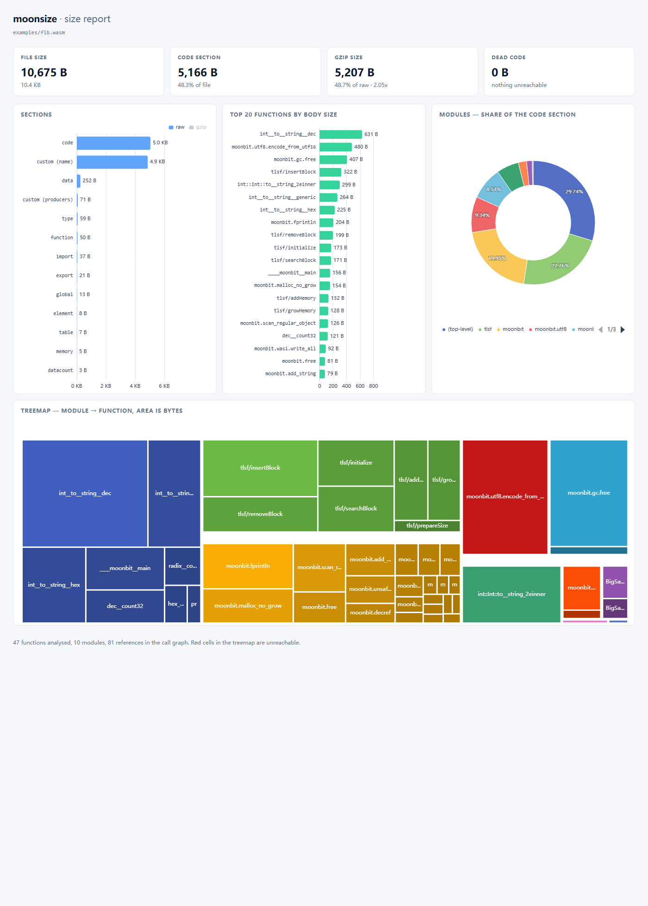

# moonsize

```sh
moon add BigSaltyMan/moonsize
```

面向 MoonBit 产物的 WebAssembly 体积分析器。读取 `.wasm` 文件，测量每个段，把 code 段归因到具体函数，跟随调用图，并报告哪些部分可以删除。

分析模型参考 [Twiggy](https://github.com/rustwasm/twiggy)：体积归因到单个函数，函数按包聚合，从模块根出发的可达性决定哪些是真正被用到的。

英文版见 [README.md](README.md)。

## 构建

```sh
moon build --release
./_build/native/release/build/cmd/main/main.exe app.wasm
```

## 用法

```
moonsize <file.wasm> [--top <n>] [--retained] [--dead-code] [--compress]
                     [--call-graph <path>] [--html <path>]
                     [--max-size <size>] [--baseline <path.wasm>]

  --top <n>            排名显示多少个函数（默认 10）
  --retained           删除每个函数能连带释放多少
  --dead-code          从根不可达的函数
  --compress           文件和每个段 gzip 压缩后要花多少字节
  --call-graph <path>  把调用图写成 .dot 或 .json
  --html <path>        把图表写成自包含的 HTML 报告
  --max-size <size>    超过这个大小就以退出码 3 失败，size 可以是字节数或
                       10KB、1.5MB 这种带 KB/MB/GB 后缀的写法
  --baseline <path>    与另一个模块对比并打印变化；此时 --max-size 限制的是
                       增量，而不是文件本身
```

不带参数时打印段表、最重的函数和按包聚合的结果。`--retained` 和 `--dead-code` 追加各自的章节，可以组合使用。`--call-graph` 和 `--html` 写文件而不是打印报告，因此单独使用：

```sh
moonsize app.wasm --retained --dead-code        # 完整文本报告
moonsize app.wasm --html report.html            # 图表，浏览器打开
moonsize app.wasm --call-graph graph.dot        # 给 Graphviz
```

## 分析原理

下面所有内容都建立在一个判断上：一个函数的字节，只有在有东西能调用它时才有意义。

### 符号名

一切归因都从二进制 name 段里的名字开始。MoonBit 没有公开它的 mangling 规则，所以这里的规则是从真实构建的 name 段里反读出来的（`moonc` 0.1.20260920，`wasm` 后端）：

- 符号形如 `_M0<kind>` 再接一条路径：`F` 普通函数，`M` 方法，`I` trait 实现；
- 包标记是 `B`（builtin 包）、`C`（`moonbitlang/core`）或 `P` 加一个索引——索引数字会和第一个组件的长度连在一起，所以 `P55probe` 是索引 `5` 接着 `5probe`；
- 组件是「长度 + 名字」，且长度数的是 **mangled 之后** 的名字；
- 不能出现在标识符里的字符用 `_` 加该字节的十六进制转义，字面下划线则写成双下划线：`to__string_2einner` 是 `to_string.inner`，`_24default__impl` 是 `$default_impl`；非 ASCII 字符按 UTF-8 逐字节转义，`中` 就是 `_e4_b8_ad`；
- 泛型实例带 `G...E`，每个实参一个编码：内置类型是单个字母，元组是 `U...E`，具名类型是 `R` 加一条路径；
- 闭包要么是名为 `__moonbit_<fn>` 的环境，要么函数体带 `C<id>l<line>`（闭包 id 与它所在的源码行号）；
- trait 实现会写出两个包：类型所在的包和 trait 所在的包。

报告里打印的是 `display_name` 解出的路径。`demangle_full` 是更完整的解码器，供需要「转义还原 + 实参展开 + 闭包标记」的调用方使用。两者都只是展示工具而非编解码器：解不出来的符号原样返回——编出一个名字比显示原始符号更糟。已知的边界就是会原样返回的情况：类型编码不是构建实际产出过的字母（`Int`、`Double`、`String`、`Bool`、`Char`、`Byte`、`Float`、`Int64`、`UInt64`、`Unit`）时，实参不做猜测；具名实参只有在列表最后一位时才解码，因为它的路径没有终止符，无法与后面的内容区分；超过 4096 字节的符号直接拒绝，避免伪造的名字把回溯拖进深递归。

### 调用图

解码器逐条指令遍历每个函数体——完整的 MVP 指令集、`0xFC` 的饱和转换与批量内存操作码、MoonBit 会发出的异常处理与尾调用操作码，以及其 `wasm-gc` 后端使用的 `0xFB` 垃圾回收操作码。每个函数体贡献：

- `call x` —— 指向 `x` 的精确边；
- `ref.func x` —— 一次引用，算作可达，因为该函数之后可能作为闭包被运行；
- `call_indirect` —— 指向该 table 中**所有**可能函数的保守边。table 的内容静态不可知，所以候选集取全集：漏一条边就等于漏一个函数、把一个还在用的函数报成死代码，这是这里唯一值得避免的错误。

如果外部世界能到达一个函数，它就是**根**：它被导出、它是 start 函数，或者它位于某个 table 中。从这些根可达的一切都是活的，其余都是死的。

### Retained Size

`SIZE` 是函数自身的体积。`RETAINED` 是删掉它实际能释放的体积：它自己的字节加上所有随之变得不可达的函数，`DIES` 是后者的个数。

这个集合恰好是被删函数所**支配**的函数集合——从根出发的每一条路径都必须经过的那些。把模块的图取出，在真实根之上加一个虚拟根，求支配树，一次就能得到所有函数的 retained size。环由不动点自然收敛，不需要特判；结果是精确的，而不是靠局部前驱数量做的近似：如果两条分支都调用某个函数，删掉其中一条分支不会释放它，但删掉两条分支汇合的那个点会。

怎么读这张表：

- `RETAINED == SIZE` —— 这个函数只对自己负责，删掉它只省下它自己的字节。
- `RETAINED ≫ SIZE` 且 `DIES` 较大 —— 好的候选。删掉它会带走一整棵子树。
- `IND` —— 该函数可以通过 `call_indirect` 到达，只有在没有 table 槽位和间接调用依赖它时才能安全删除。

两个数都打印是有意的。`SIZE` 说明编译期把函数改小能省多少；`RETAINED` 说明直接删掉它省多少，后者通常是更便宜的改动。

### 死代码

从根不可达的一切都不会运行：没有导出能到达它，没有 start 函数，没有 table 槽位，也没有从上述任何一处出发的调用链。它的字节已经付出代价却从未被使用，所以这份清单就是一份删除清单。

MoonBit 编译器的死代码消除做得很好，因此小程序通常报告为零——这本身也是一个结论。

### 压缩后体积

WebAssembly 模块不会以原始形式传输，服务端发的是 gzip 之后的内容，而省下多少完全取决于字节长什么样：机器码压不太动，符号名和字符串压得很狠，已经打包好的数据几乎不动。所以只看原始段表会在两个方向上误导人，`--compress` 回答的是网络真正关心的问题：

```
COMPRESSED SIZE
  raw   10675 B
  gzip   5207 B  (48.7% of raw, ratio 2.05x)

  BY SECTION

  SECTION              RAW  GZIP  RATIO  SHARE(GZIP)
  code                5166  2712  1.90x        52.0%
  custom (name)       4975  1983  2.50x        38.0%
  data                 252   174  1.44x         3.3%
  custom (producers)    71    95  0.74x         1.8%
  type                  59    66  0.89x         1.2%
  function              50    63  0.79x         1.2%
  import                37    61  0.60x         1.1%
  export                21    45  0.46x         0.8%
  global                13    34  0.38x         0.6%
  element                8    32  0.25x         0.6%
  table                  7    31  0.22x         0.5%
  memory                 5    29  0.17x         0.5%
  datacount              3    27  0.11x         0.5%
```

`SHARE(GZIP)` 是段压缩后大小占**整个文件压缩后**大小的比例，而不是占原始大小的比例——这一列才是要看的。这里 code 段原始占文件的 48.3%，压缩后涨到 52.0%；name 段则相反，原始 46.6%，压缩后只剩 38.0%。真正值得下手的是编译器吐出来的字节；符号名在网络上几乎是免费的，这件事最好在花一下午搞 `--strip` 之前就知道。

读这张表有两点要留意。它是估算：压缩器跑在默认等级（也就是服务端常用的等级），但服务端配置未必相同，而且它是把整个响应当一个流压，而不是每段独立压。另外每段都是独立的流，各自要付大约二十字节的 gzip 容器开销——对上千字节的段可以忽略，对只有几个字节的段就是主要成本，这也是表里最小的那些段"压完反而变大"的原因。占比几乎不受影响，因为二十字节放在上千字节的表里不算什么。

### 判断哪些可以删

1. 先看 `--dead-code`。那里每一行都可以直接删；确认没有模块外部按名字调用它（如果被导出，它就已经是根了，所以这一点已经被考虑在内）。
2. 再看 `--retained` 中 `RETAINED` 很大且 `DIES` 大于零的行。这些是删除后会连锁的函数。
3. 对带 `IND` 的行要谨慎：间接候选只有在 table 槽位和调用点一起删除时才安全。

## HTML 报告

`--html <path>` 把同一份分析写成一个自包含页面：不需要服务器、不需要构建步骤、不需要联网。打开文件就能看到四张图。



仓库里放了一份现成的例子：[`examples/report.html`](examples/report.html)，由 [`examples/fib.wasm`](examples/fib.wasm) 生成——一个 10,675 字节的 MoonBit 程序。它只有一个文件：图表库被内联进去，所以可以随意移动、发送、在任何地方打开。它的源码是 [`examples/fib.mbt`](examples/fib.mbt)，同时也是本模块的一个包：构建 `--target wasm` 时会连同工具一起产出这个示例。

**顶部三个数字。** 文件总大小、code 段大小，以及文件中不可达部分的大小。第三张卡片在有东西可删时会变红——多数人打开报告就是为了这个数。

**Sections（段概览）** —— 每个段一条横向条形，按体积从大到小排列，悬浮提示里给出占文件的比例。这就是第一阶段的段表，画出来了。两张条形图的高度都按行数自适应，保证每一行都带标签；固定高度会让 ECharts 丢掉大部分标签，而幸存下来的那几个看起来就像是下面无标签行的分组标题——这正是"code 段被拆成三条"的错觉来源。

**Top 20 functions by body size** —— 编译器还能压缩的部分。这里用的是 body 大小而不是编码后大小，让排名回答"代码在哪里"，而不是"长度前缀在哪里"。

**Modules（模块聚合）** —— 环形图，展示 code 段如何在各包之间划分；分母是 code 段而非整个文件，所以每一片的含义是"哪个包占用了代码"。低于 0.5% 的扇区合并为一个 `other` 扇区，悬浮时列出成员：这么窄的扇区放不下标签，单独留着只会是一道既读不了也点不中的细缝。标签画在环内，因此不会与图例碰撞。

**Treemap** —— 模块 → 函数两级，面积代表字节数。这是唯一一张一次展示整个二进制的图：面积大的格子就是值得看的函数，函数不可达时格子画成红色。

悬浮任意条形、扇区或格子都会显示精确字节数与百分比。页面里每个数字都来自文本报告所用的同一个 `Analysis`，两者不可能对不上。

图表库 vendored 在 [`assets/echarts.min.js`](assets/README.md)，并被内联进页面。当该文件不在工作目录旁时——比如从别处运行已安装的二进制——页面会退回到 CDN 的 `<script src>` 标签，命令也会明确提示；那种报告需要联网才能绘制。

## 输出示例

一个 10,675 字节的 MoonBit 程序（`--target wasm`，debug），只保留分析章节：

```
Retained size

    #  INDEX  SIZE  RETAINED  DIES    SHARE  IND  FUNCTION
    1     47   158      5162    46    48.3%       ____moonbit__main
    2     39   301      1773    10    16.6%       int::Int::to__string_2einner
    3     37    24       887     8     8.3%       println
    4     34     9       819     5     7.6%       moonbit.println
    5     33   206       810     4     7.5%       moonbit.fprintln
    6     28    49       717     7     6.7%       moonbit.decref
    7     29   409       668     6     6.2%       moonbit.gc.free
    8     43   633       633     0     5.9%       int__to__string__dec

  DIES counts the other functions that become unreachable with this one.
  IND marks a function a call_indirect could reach.

Dead code

  0 of 47 functions are unreachable from the roots
  0 bytes (0.0% of file)

  every function is reachable
```

`____moonbit__main` retained 5,162 字节——占文件的 48.3%，牵连 46 个函数——这正是单入口程序的样子：所有东西都挂在它下面。`int__to__string__dec` 是最大的单个函数（633 字节），但只 retained 自己，所以要缩小它属于改代码，而不是删代码。

`--call-graph graph.dot` 把同一张图写给 Graphviz，死函数画成虚线，间接边画成点线；`--call-graph graph.json` 则输出根、每条边以及每个间接调用点的候选集。

## CI 集成

`--max-size` 把报告变成一道闸门，`--baseline` 把它变成一次对比，于是构建可以因为「变大了」而失败，而不是因为某个人得手动维护的那个数字。

```sh
moonsize app.wasm --max-size 100KB                     # 给文件一个上限
moonsize app.wasm --baseline main.wasm --max-size 5KB  # 最多增长 5 KB
```

带 baseline 时，`--max-size` 限制的是**增量**而不是文件本身：一个 PR 要回答的问题是「它多花了多少」，而不是「程序本来有多大」。带 baseline 运行时，报告之后会打印对比表，按当前体积从大到小排列，增量同时给出字节数和相对基线的比例：

```
SIZE COMPARISON

                      baseline  current  delta
  total                  10675    11039  +364  (+3.4%)
  code                    5166     5299  +133  (+2.5%)
  custom (name)           4975     5205  +230  (+4.6%)
  data                     252      252  0  (0.0%)
  custom (producers)        71       71  0  (0.0%)
  ...
```

退出码：`0` 正常，`1` 输入无法读取，`2` 命令行错误，`3` 超出预算。CI 既可以只依据预算判定失败，也能把「输入坏了」和「构建坏了」区分开。

本仓库用 [`.github/workflows/ci.yml`](.github/workflows/ci.yml) 给自己上闸：格式检查、`moon check --target native --deny-warn`、`moon test`，以及把示例文件限制在预算内。

```yaml
- uses: moonbit-community/setup-moonbit@v1
- name: The example stays inside its budget
  run: moon run cmd/main -- --max-size 100KB examples/fib.wasm
```

任何产出 `.wasm` 的项目都可以用同样的三行：

```yaml
- uses: moonbit-community/setup-moonbit@v1
- run: moon build --target wasm --release
- name: Size budget
  run: moonsize _build/wasm/release/build/app/app.wasm --max-size 250KB
```

如果要卡的是「增长」而非绝对体积，就把 base 分支也编译一份作为基线，此时 `--max-size` 的含义变成允许的增量：

```yaml
- name: Build the base branch
  run: |
    git worktree add "$RUNNER_TEMP/base" "origin/${{ github.base_ref }}"
    (cd "$RUNNER_TEMP/base" && moon build --target wasm --release)
- name: Size budget
  run: |
    moonsize _build/wasm/release/build/app/app.wasm \
      --baseline "$RUNNER_TEMP/base/_build/wasm/release/build/app/app.wasm" \
      --max-size 5KB
```

[`.github/workflows/size-check.yml`](.github/workflows/size-check.yml) 在每个 PR 上做的就是这件事。`examples/` 现在是本模块的一个包，所以两边都按同样的方式编译示例，对比的是同一份源码的两次构建：

```sh
moon build --target wasm                        # 产出示例 wasm
moon run cmd/main -- that.wasm --baseline base.wasm --max-size 5KB
```

## 开发

```sh
moon check --target native --deny-warn
moon test
```

测试逐条覆盖指令表——每条指令带一个规范编码和规范给出的长度——并固定了三个真实的 MoonBit 函数体，其中一个是 locals 使用两字节 GC 引用类型的，这样一旦某个立即数宽度写错，失败的是一个测试，而不是悄悄产生一张错误的调用图。

### 重新生成示例

[`examples/report.html`](examples/report.html) 和本 README 里引用的数字——文件大小、段占比、Retained Size——都是从真实构建产物里读出来的，不是手写的。所以改了 [`examples/fib.mbt`](examples/fib.mbt)，或者升级了工具链之后，它们就过期了，三步都得重跑：

```sh
moon build --target wasm
moon run cmd/main -- --html examples/report.html examples/fib.wasm
# 然后按这个页面重新截 examples/report.png
```

第一步构建 `examples/`，产物落在 `_build/wasm/debug/build/examples/examples.wasm`；`examples/fib.wasm` 是它的副本，报告由这份 wasm 生成，截图则是那份报告在 1400px 宽、整页高度下的截取。`examples/` 下没有任何东西是手改的——所以那里出现过期数字，意味着构建过期，而不是打错了字。
